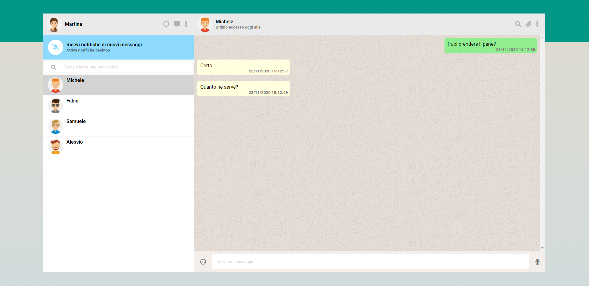

<h1>BoolzApp</h1>

Replica della versione web di WhatsApp. Tecnologie usate: HTML, CSS, JavaScript con Vue.js.

Funzioni: 

<ul>
  <li>Invio messaggi</li>
  <li>Filtro contatti nella lista</li>
  <li>Cambio finestra conversazione</li>
  <li>Risposta automatica</li>
  <li>Gestione della data in tempo reale</li>
</ul>

